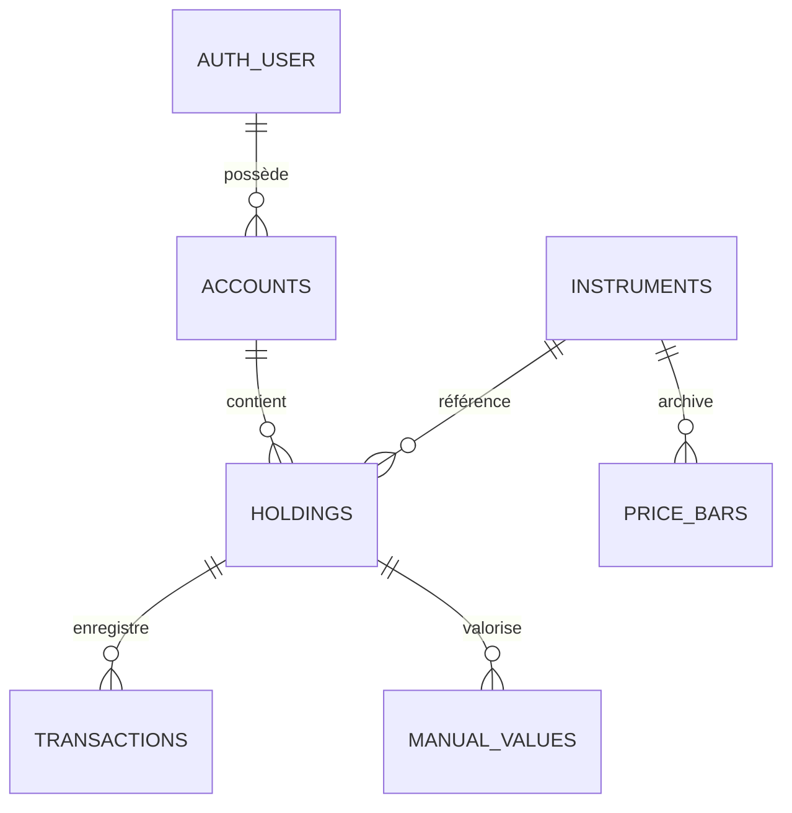

# Base de Connaissances — Application Patrimoine

Ce document synthétise l'architecture, les choix techniques, les règles métier, le modèle de données et les bonnes pratiques du projet **Patrimoine** (`lscharf/patrimoine`). Il sert de référence complète pour la maintenance et les évolutions futures.

---

## 1. Vue d'ensemble & Philosophie

**Patrimoine** est une application web auto-hébergée de gestion et de suivi de patrimoine financier personnel.

### Principes directeurs
1. **Souveraineté des données** : Pas de service tiers pour stocker les comptes ou les montants. Tout réside dans un fichier SQLite local (`portfolio.db`).
2. **Reconstitution dynamique plutôt qu'instantanés figés** : La courbe de valeur et la performance ne sont pas des captures quotidiennes stockées, mais sont recalculées jour après jour à partir des transactions, des cours de clôture et des taux de change historiques. Une transaction passée saisie aujourd'hui recalcule fidèlement tout l'historique.
3. **Performance financière réelle (nette d'apports)** : Tout apport de capital (achat ou dépôt) ou retrait (vente ou rachat) est exclu du calcul de gain : $\text{Gain} = \text{Valeur Finale} - \text{Valeur Initiale} - \text{Apports Nets}$.
4. **Confidentialité par conception** : Mode « masquage des montants » persistant (cookie `montants-masques`) injecté dès le rendu HTML serveur pour éviter tout scintillement ou fuite visuelle.
5. **Robustesse opérationnelle** : Migrations automatiques et idempotentes au démarrage du conteneur, gestion du mode WAL de SQLite, sondes de santé découplées de la base pour éviter les boucles de redémarrage lors des migrations.

---

## 2. Stack Technique & Dépendances

| Composant | Technologie / Librairie | Rôle |
|---|---|---|
| **Framework** | Next.js 16.3.2 (App Router) | Rendu hybride RSC / Client, Server Actions, Route Handlers |
| **Runtime / Langage** | Node.js 22 (Debian Bookworm) / TypeScript 5 | Typage strict, interopérabilité glibc avec better-sqlite3 |
| **Interface & UI** | React 19, Tailwind CSS v4, Radix UI primitives, Lucide React, Motion | Interface épurée sombre, accessible, transitions fluides |
| **Visualisation** | `@visx` (Scales, Shapes, Curves, Gradients, Responsive) | Graphiques SVG personnalisés (courbe temporelle, allocation donut) |
| **Base de données & ORM** | `better-sqlite3` 13 + `drizzle-orm` 0.45 + `drizzle-kit` | SQLite local en mode WAL avec foreign keys |
| **Authentification** | `better-auth` 1.7 (Drizzle Adapter) | Email/Mot de passe local + OIDC générique (Authelia) avec PKCE |
| **Cotations financières** | `yahoo-finance2` 4.0 | Recherche de tickers, cours live, barres daily, intraday, devises |
| **Validation** | `zod` 4.4 | Validation stricte des formulaires et des Server Actions |
| **Gestion des dates** | `date-fns` 4.4 + APIs natives `Intl` | Formats localisés `fr-FR`, typographie rigoureuse |

---

## 3. Architecture du Code Source

```
patrimoine/
├── drizzle/                    # Migrations SQL versionnées (Drizzle Kit)
├── docs/                       # Guides d'exploitation (ex: docker.md)
├── scripts/
│   ├── check-engine.mts        # Validation en CLI du moteur de calcul & performance
│   └── create-user.ts          # Création CLI d'utilisateur local (dev)
├── src/
│   ├── app/                    # Pages et routes Next.js App Router
│   │   ├── (dashboard)/page.tsx # Vue d'ensemble (Patrimoine, graphiques, allocation, lignes)
│   │   ├── comptes/            # Liste des enveloppes / comptes
│   │   │   └── [id]/page.tsx   # Détail d'un compte avec ses lignes et historique
│   │   ├── lignes/[id]/page.tsx # Détail d'une ligne (métriques, valorisations, transactions)
│   │   ├── transactions/page.tsx# Journal global de toutes les opérations
│   │   ├── connexion/page.tsx  # Écran de connexion / onboarding premier run
│   │   ├── api/auth/[...all]/  # Handler HTTP Better Auth
│   │   └── api/health/route.ts # Healthcheck HTTP Docker (ne touche pas la DB)
│   ├── components/
│   │   ├── auth/               # Formulaires login / signup, menu utilisateur
│   │   ├── chart/              # PortfolioChart (Visx + LTTB), AllocationDonut
│   │   ├── forms/              # Dialogues d'ajout/édition de comptes, lignes, transactions
│   │   ├── privacy/            # Composant <Montant> et toggle de confidentialité
│   │   ├── ui/                 # Primitives UI Radix stylisées
│   │   └── ...                 # Tableaux, résumé de portefeuille, badges de variation
│   ├── db/
│   │   ├── schema.ts           # Schéma relationnel du portefeuille (Drizzle)
│   │   ├── auth-schema.ts      # Schéma Better Auth (préfixé auth_*)
│   │   ├── index.ts            # Connexion singleton SQLite WAL + exécution auto des migrations
│   │   ├── migrate.ts          # Script de migration autonome
│   │   ├── seed.ts             # Jeu de données de démonstration complet
│   │   └── reset.ts            # Remise à zéro sans toucher au cache de cours
│   ├── lib/
│   │   ├── format.ts           # Formatage fr-FR (devises, prix, pourcentages, signe moins U+2212)
│   │   ├── privacy.ts          # Gestion du cookie de masquage des montants
│   │   ├── range.ts            # Parser et validateur de la période temporelle (?p=)
│   │   ├── safe-redirect.ts    # Validation des redirections post-connexion
│   │   └── utils.ts            # Utilitaire `cn` (clsx + tailwind-merge)
│   └── server/
│       ├── queries.ts          # Queries de lecture Server-Side (dédupliquées via React cache())
│       ├── actions/            # Server Actions Next.js (mutations + vérifications de droits)
│       │   ├── index.ts        # Handlers de mutation (CRUD comptes, lignes, transactions)
│       │   └── schemas.ts      # Schémas Zod des inputs utilisateurs
│       ├── auth/
│       │   ├── config.ts       # Configuration Better Auth, liste blanche, OIDC Authelia
│       │   ├── session.ts      # Helpers `requireSession()`, `requireUserId()`
│       │   ├── first-run.ts    # Détection de première installation (`aucunCompteExistant`)
│       │   └── ownership.ts    # Vérification stricte de propriété sur toute l'arborescence
│       ├── prices/
│       │   ├── provider.ts     # Interface PriceProvider + types de cotation
│       │   ├── yahoo.ts        # Implémentation Yahoo Finance avec retries et normalisation
│       │   └── cache.ts        # Cache SQLite & mémoire des cours, barres et taux de change
│       └── portfolio/
│           ├── types.ts        # Types métiers (HoldingSnapshot, PortfolioSnapshot, Range, etc.)
│           ├── cost-basis.ts   # Calcul du PRU pondéré, timeline de quantité, flux nets
│           ├── snapshot.ts     # Construction du snapshot temps réel du portefeuille
│           └── history.ts      # Moteur de reconstruction de la courbe historique (daily + intraday)
```

---

## 4. Modèle de Données (Schéma SQLite / Drizzle)

### Arborescence du portefeuille



### Tables principales (`src/db/schema.ts`)
- **`accounts`** : Enveloppe fiscale ou compte de dépôt (`kind` : `PEA`, `CTO`, `PEE`, `AV`, `LIVRET`, `CRYPTO`, `OTHER`). Rattaché à un `userId`.
- **`instruments`** : Actifs financiers cotés mutualisés entre utilisateurs (`symbol`, `name`, `type`, `currency`, `exchange`, cache de prix `lastPrice`, `prevClose`, `lastPriceAt`, et métadonnées de borne `historyThrough`, `historyCheckedAt`, `historyFrom`).
- **`holdings`** : Ligne au sein d'un compte (`kind` : `QUOTED` ou `MANUAL`). Porte un libellé, une devise et optionnellement un `instrumentId`.
- **`transactions`** : Opérations unitaires sur une ligne :
  - `BUY` / `SELL` : pour les lignes cotées (`quantity`, `unitPrice`, `fees`).
  - `DIVIDEND` / `FEE` : flux de trésorerie associés (`amount`).
  - `DEPOSIT` / `WITHDRAWAL` : versements et retraits pour les lignes non cotées (`amount`).
- **`manual_values`** : Historique des valorisations saisies pour les lignes non cotées (`holdingId`, `date`, `value`).
- **`price_bars`** : Cache des clôtures quotidiennes (`instrumentId`, `date`, `close`). Clé primaire composite `(instrument_id, date)`.
- **`fx_bars`** & **`fx_state`** : Cache des taux de change historiques et état de synchronisation vers l'euro (`pair`, `date`, `rate`).

### Tables d'authentification (`src/db/auth-schema.ts`)
- **`auth_user`**, **`auth_session`**, **`auth_account`**, **`auth_verification`** (gérées par Better Auth avec Drizzle adapter).
- Préfixées `auth_` pour ne pas entrer en collision avec `accounts` (comptes financiers).

---

## 5. Moteur Financier & Règles Métier

### 5.1. Prix de Revient Unitaire (PRU) — `cost-basis.ts`
- **Méthode** : Prix Moyen Pondéré (standard fiscal français PEA / CTO).
- **Multi-devises** :
  - Le prix de revient est conservé en devise locale (pour comparer au cours coté).
  - Le coût en euros est converti au **taux de change historique de la date de chaque transaction**. Cela permet de capturer fidèlement l'effet de change dans la performance totale.
- **Vente partielle** :
  $$\text{part vendue} = \min\left(\frac{\text{quantité vendue}}{\text{quantité détenue}}, 1\right)$$
  $$\text{coût retiré} = \text{coût total} \times \text{part vendue}$$
  $$\text{plus-value réalisée} = (\text{produit net de vente} \times \text{fx}) - \text{coût retiré}$$

### 5.2. Reconstruction de la Courbe Historique — `history.ts`
La courbe n'est pas une table d'historique de soldes :
1. Détermination de la date de départ selon la période demandée (`1J`, `7J`, `1M`, `3M`, `6M`, `YTD`, `1A`, `TOUT`).
2. Génération d'une grille de dates continues (`dateGrid`).
3. Reconstitution de la quantité détenue à chaque jour $t$ (`quantityTimeline`).
4. Projection des cours historiques et des taux de change sur la grille avec propagation de la dernière valeur connue (`forwardFill` pour week-ends et jours fériés).
5. Sommation des valorisations journalières par ligne et agrégation globale.
6. Remplacement du dernier point par la valeur temps réel live (`liveTotal`).
7. Rééchantillonnage de la courbe par l'algorithme **LTTB** (*Largest Triangle Three Buckets*, plafonné à 420 points) pour préserver les extrêmes sans surcharger le DOM/SVG.

### 5.3. Performance Nette d'Apports
Sur toute période $[t_{\text{start}}, t_{\text{end}}]$ :
$$\text{Performance (€)} = V_{\text{end}} - V_{\text{start}} - \text{Flux Nets}$$
$$\text{Flux Nets} = \sum (\text{Achats} + \text{Dépôts}) - \sum (\text{Ventes} + \text{Retraits})$$
$$\text{Performance (\%)} = \frac{\text{Performance (€)}}{V_{\text{start}} + \max(\text{Flux Nets}, 0)}$$
*Note : Les dividendes et les frais de courtage ne sont pas des apports de capital externe ; ils font partie intégrante de la performance.*

### 5.4. Traitement Intraday (1J et 7J)
- 1J : fenêtre glissante de 24h avec pas de 5 minutes (`5m`).
- 7J : fenêtre glissante de 7 jours avec pas de 1 heure (`1h`).
- Les données intraday sont conservées dans un cache mémoire en processus (`intradayCache`, TTL 5 minutes) et ne sont pas écrites en base pour éviter d'engorger SQLite.

---

## 6. Système de Cotations & Cache

L'interface `PriceProvider` (`src/server/prices/provider.ts`) découple la logique de valorisation du fournisseur de données (Yahoo Finance).

### Politiques de Cache (`src/server/prices/cache.ts`)
- **Cours temps réel (Quotes)** : TTL 60 secondes. Requêtes groupées par batch de symboles.
- **Clôtures historiques (Daily)** : Stockées en base `price_bars`. Rafraîchissement différé de minimum 1 heure (`HISTORY_RECHECK_MS = 60 min`).
- **Garde-fous anti-rafales** :
  - `history_checked_at` : Évite de réinterroger les bourses fermées (week-ends, jours fériés) qui n'ont rien de nouveau à délivrer.
  - `history_from` : Mémorise la date la plus ancienne déjà sollicitée pour un instrument, évitant de redemander indéfiniment un historique que le fournisseur ne possède pas.

---

## 7. Sécurité & Authentification

### Double couche de contrôle
1. **Middleware optimiste Edge** (`src/middleware.ts`) : Vérifie simplement l'existence du cookie de session pour rediriger immédiatement vers `/connexion`.
2. **Cloisonnement strict Server-Side** :
   - `requireUserId()` dans `src/server/queries.ts` pour filtrer chaque requête SQLite par `userId`.
   - Contrôles de propriété systématiques dans `src/server/auth/ownership.ts` (`ownsAccount`, `ownsHolding`, `ownsTransaction`, `ownsManualValue`) avant chaque mutation dans `src/server/actions/index.ts`.
   - Réponses d'erreur uniformisées pour « introuvable » et « non autorisé » afin de prévenir l'énumération d'identifiants.

### Politiques d'accès
- **Liste blanche fermée par défaut** : `AUTH_ALLOWED_EMAILS` est obligatoire. Tout compte ou token OIDC dont l'adresse ne figure pas dans cette liste est rejeté lors de la création ET à chaque nouvelle session.
- **Onboarding / First-Run** : Si la base est vierge (`aucunCompteExistant()`), `/connexion` affiche le formulaire de création du premier compte local. Dès qu'un compte existe, ce formulaire disparaît définitivement.
- **Support OIDC (Authelia)** : Activé automatiquement si `AUTHELIA_ISSUER`, `AUTHELIA_CLIENT_ID` et `AUTHELIA_CLIENT_SECRET` sont renseignés dans `.env`.

---

## 8. Conventions UI, Formatage & Typographie

Toutes les fonctions de formatage résident dans `src/lib/format.ts` et respectent les règles typographiques françaises :
- **Signe moins typographique** : Utilisation du caractère Unicode `−` (`U+2212`) et non du trait d'union `-` (`U+002D`).
- **Cadratin de repli** : `—` (`U+2014`) pour toute valeur nulle, indéfinie ou non finie (jamais de `NaN €`).
- **Précision adaptative des cours** :
  - $\ge 1\,000$ : 0 décimale.
  - $\ge 1$ : 2 décimales.
  - $\ge 0{,}01$ : 4 décimales.
  - $< 0{,}01$ : jusqu'à 6 décimales (adapté aux micro-cours crypto).
- **Chiffres tabulaires** : Utilisation de la classe Tailwind `tnum` (`font-variant-numeric: tabular-nums`) sur toutes les cellules de montants et de dates pour garantir un alignement parfait.

---

## 9. Exploitation, Docker & Base de Données

### Sauvegarde à chaud (WAL)
SQLite tourne en mode WAL (`Write-Ahead Logging`). Un simple `cp portfolio.db` à chaud est **incomplet** car les écritures récentes résident dans `portfolio.db-wal`.

**Procédure de sauvegarde recommandée** :
```bash
# Sauvegarde cohérente via l'API SQLite Backup
docker compose exec patrimoine node -e "
const D = require('better-sqlite3');
const db = new D(process.env.PORTFOLIO_DB_PATH, { readonly: true });
db.backup('/app/data/sauvegarde.db').then(() => { db.close(); console.log('ok'); });
"
docker compose cp patrimoine:/app/data/sauvegarde.db ./patrimoine-$(date +%F).db
docker compose exec patrimoine rm /app/data/sauvegarde.db
```

### Commandes usuelles du projet
- `npm run dev` : Démarrage du serveur Next.js en développement.
- `npm run build` : Compilation de production (génère le standalone Next.js).
- `npm run check:engine` : Exécute le moteur de snapshot et de calcul d'historique en console pour vérifier les calculs.
- `npm run seed -- --reset` : Réinitialise la base et injecte un portefeuille de démonstration complet (PEA, CTO en USD, Crypto, PEE, Livret A).
- `npm run db:reset` : Vide le portefeuille tout en conservant le cache des cours d'instruments.
- `npm run auth:user` : Crée un utilisateur en ligne de commande (mode dev).

---

## 10. Points d'Attention pour le Développement Futur

1. **Ne pas casser les Server Actions** : Toujours vérifier la propriété (`owns*`) avant toute suppression/mise à jour.
2. **Ne pas contourner `PriceProvider`** : Tout accès à des cours boursiers doit passer par l'abstraction provider / cache (`cache.ts`).
3. **Respecter `server-only`** : Les modules SQLite, Better Auth serveur et calculs de portefeuille contiennent `import "server-only";` et ne doivent jamais être importés dans des composants clients.
4. **Conservation du mode WAL** : Ne jamais désactiver le mode WAL ou les clés étrangères (`PRAGMA foreign_keys = ON`).
5. **Composant `<Montant>`** : Tout affichage d'une somme d'argent dans l'UI doit être enveloppé par `<Montant>{formatCurrency(...)}</Montant>` pour respecter le mode masquage.
